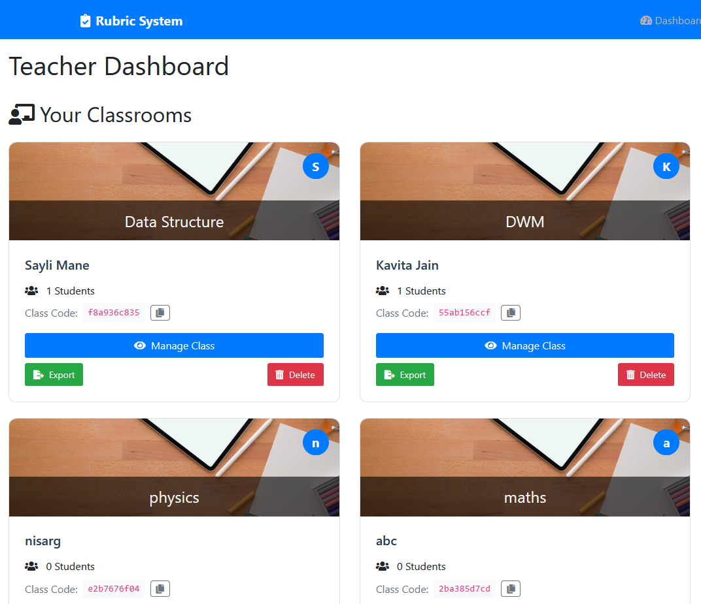
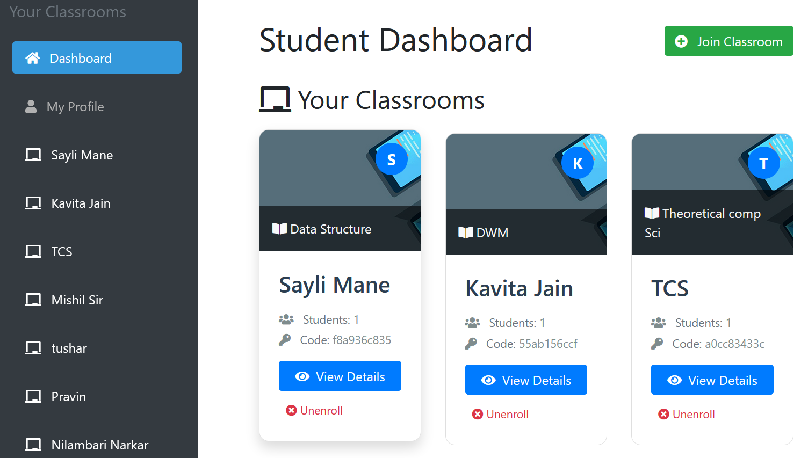
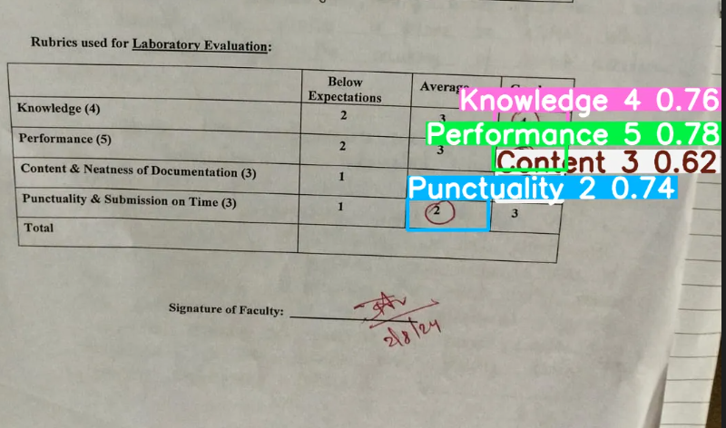
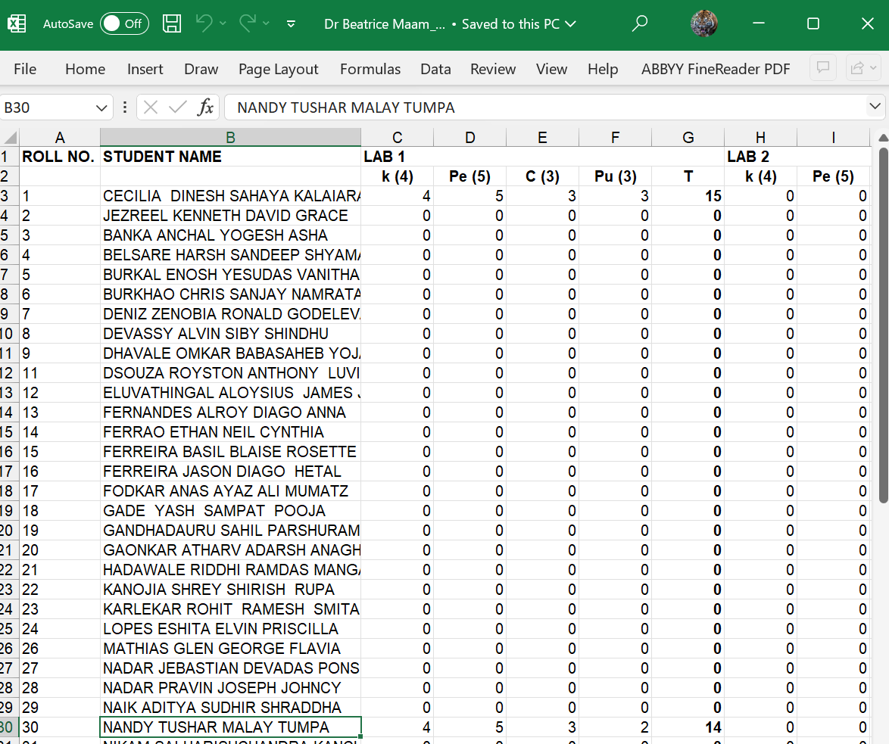

# Rubricease - Automated Rubric Management System

An AI-powered web application that automates the process of extracting and managing student marks from rubric images.

## Overview

Rubricease helps teachers and students manage classroom rubrics efficiently. Students can upload images of their graded rubrics, and the system uses AI to automatically extract grades for knowledge, performance, content/neatness, and punctuality/submission. Teachers can manage classrooms, review submissions, and export grades.

## Features

- **Role-based Authentication**: Separate interfaces for students and teachers
- **Classroom Management**: Create classrooms with secure join codes
- **AI-powered Extraction**: Automatically extract marks from rubric images
- **Grade Tracking**: Students can view their marks across all labs
- **Excel Export**: Teachers can export grades in Excel format
- **Bulk Student Creation**: Quickly create student accounts from Excel files

## Screenshots

### User Interfaces

*Teacher dashboard for managing classrooms and viewing student performance*


*Student interface for submitting rubrics and tracking grades*

### Rubric Processing

*The system automatically detects and extracts marks from rubric images*

### Grade Reports

*Exported Excel report showing student marks across experiments*

## Setup

1. Clone the repository
```bash
git clone https://github.com/Stv21/rubricsprj.git
cd rubricsprj
```

2. Set up a virtual environment
```bash
python -m venv venv
source venv/bin/activate  # On Windows: venv\Scripts\activate
```

3. Install dependencies
```bash
pip install -r requirements.txt
```

4. Run migrations
```bash
python manage.py migrate
```

5. Create a superuser
```bash
python manage.py createsuperuser
```

6. Run the development server
```bash
python manage.py runserver
```

## Usage

### For Teachers
- Create classrooms and get join codes
- Monitor student submissions
- Export grades to Excel
- Bulk create student accounts

### For Students
- Join classrooms with provided codes
- Upload rubric images
- View extracted marks
- Track progress across all labs

## Technologies

- **Backend**: Django
- **Frontend**: HTML, CSS, JavaScript, Bootstrap
- **Database**: SQLite/PostgreSQL
- **AI Integration**: Custom API endpoint for image processing
- **Authentication**: Django auth system

## Project Structure

```
rubric_project/               # Main project directory
├── manage.py                 # Django management script
├── rubric_project/           # Django project settings
│   ├── settings.py
│   └── urls.py
├── rubric_app/               # Main application
│   ├── models.py             # Database models
│   ├── views.py              # View controllers
│   ├── forms.py              # Form definitions
│   ├── urls.py               # URL routing
│   ├── templates/            # HTML templates
│   └── static/               # Static files (CSS, JS, images)
├── media/                    # User-uploaded content
│   └── rubrics/              # Uploaded rubric images
└── screenshots/              # Project screenshots
```

## API Usage

The system integrates with an external API for image processing:
```python
api_url = "https://xaviers--rubricease-infer.modal.run/api/predict"
```

Marks are extracted in four categories:
- Knowledge (K): Out of 4
- Performance (Pe): Out of 5
- Content & Neatness (C): Out of 3
- Punctuality & Submission (Pu): Out of 3

## Project Repository

[https://github.com/Stv21/rubricsprj](https://github.com/Stv21/rubricsprj)

## Author

- [Steven](https://github.com/Stv21)